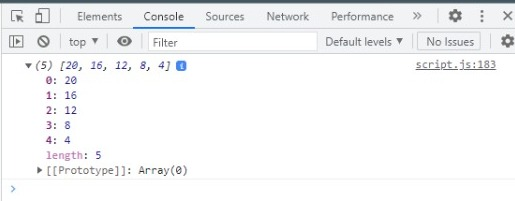

# Writing Week 3

# JavaScript Intermediate
## Aray
- Definisi </br>
Array adalah tipe data list order yang dapat menyimpan tipe data apapun di dalamnya. Array dapat menyimpan tipe data String, Number, Boolean, dan lainnya. </br>
contoh aray:
    ```js
    let toDoList = [
        'Belajar Javascript'
        'Mencuci Baju'
        'Latihan membuat aplikasi javascript'
    ];
    console.log(toDoList);
    ```
    Hasilnya pada saat di console: </br>
    
- **Membuat Aray** </br>
Aray didefinisikan menggunakan square brackets. square brackets yaitu sebuah tanda seperti `[]`
- **Mengakses/Memanggil Aray** </br>
Array pada javascript dihitung dari index data ke-0 Data pertama adalah index ke-0.

- **Update Aray**</br>
Seperti tipe data dan variabel pada umumnya, kita dapat mengupdate data pada Array
    ```js
    let toDoList = [
        'Belajar Javascript'
        'Mencuci Baju'
        'Latihan membuat aplikasi javascript'
    ];
    toDolist[1] = 'Belajar Dom';
    console.log(toDoList);
    ```
    dari kodingan di atas maka index ke-1 yang berisi Mencuci baju akan di update dengan index baru yaitu Belajar Dom. hasil dari console kodingan di atas akan seperti berikut </br>
        

- **Const in Array** </br>
    - Jika menggunakan let, kita dapat mengubah array  dengan array baru dan konten nilai yang ada di dalam array dengan nilai lain
    - Const tidak bisa melakukan update data. Namun pada Array kita dapat melakukan update konten nilai di dalam array (mutable).
    - Yang tidak bisa adalah mengubah array dengan array yang baru jika menggunakan const

- **Array Properties**</br>
Array memiliki 5 properti yang sering digunakan yaitu constructor, length, index, input, dan prototype. Properties adalah fitur yang sudah disediakan oleh Javascript untuk memudahkan developer.
- .length </br>
    length akan mengembalikan nilai dari jumlah panjang data suatu array.
    ```js
    let toDoList = [
    'Belajar Javascript',
    'Mencuci Baju',
    'Latihan membuat aplikasi javascript'
    ];
    console.log(toDoList.length);
    ```
    maka output nya adalah :</br>
    

- **Array Method** </br>
Array memiliki method atau biasa disebut built-in methods.Artinya Javascript sudah memudahkan kita dengan menyediakan function/method umum yang bisa kita gunakan. Kita tidak perlu membuat function lagi jika method yang kita butuhkan sudah tersedia.
Sama halnya dengan Array properti.
> contoh array Built-in Methods</br>
1. .push()</br>
 .push() adalah method untuk menambahkan item  array pada urutan yang paling akhir.
    ```js
    let toDoList = [
    'Belajar Javascript',
    'Mencuci Baju',
    'Latihan membuat aplikasi javascript'
    ];
    toDoList.push("Mengikuti kelas online via zoom");
    console.log(toDoList);
    ```
    maka output nya adalah :</br>
    

2. .pop()</br>
    .pop() adalah method yang menghapus item array index terakhir.
    ```js
    let toDoList = [
    'Belajar Javascript',
    'Mencuci Baju',
    'Latihan membuat aplikasi javascript'
    ];
    toDoList.pop();
    console.log(toDoList);
    ```
    maka output nya adalah :</br>
    

3. .shift()</br>
    .shift() adalah method untuk menghapus item Array pada index pertama
    ```js
    let toDoList = [
    'Belajar Javascript',
    'Mencuci Baju',
    'Latihan membuat aplikasi javascript'
    ];
    toDoList.shift();
    console.log(toDoList);
    ```
    maka output nya adalah :</br>
    

4. .unshift()</br>
    .unshift() adalah method untuk menambahkan item Array pada index pertama
    ```js
    let toDoList = [
    'Belajar Javascript',
    'Mencuci Baju',
    'Latihan membuat aplikasi javascript'
    ];
    toDoList.unshift("mengikuti kelas online via zoom");
    console.log(toDoList);
    ```
    maka output nya adalah :</br>
    

5. .sort()</br>
    .sort() adalah method untuk mengurutkan secara Ascending atau Descending Alphanumeric
    ```js
    const number = [5, 4, 3, 2, 1];
    number.sort();
    console.log(number);
    ```
    maka pada saatt di console hasilnya akan seperti ini:</br>
    

- **Looping Pada array**</br>
Array memiliki built in methods untuk melakukan looping yaitu `.map()` dan `.forEach()`. Kita harus tahu kapan menggunakan `.map()` dan juga `.forEach()`
1. .forEach()</br>
    .forEach() adalah method untuk melakukan looping pada setiap elemen array.
    ```js
    const cars = ['tesla', 'honda','avanza'];
    cars.forEach(element => {
    console.log(element);
    });
    ```
    hasil saat di console:</br>
    

2. .map()</br>
    .map() melakukan perulangan/looping dengan membuat array baru.
    ```js
    let arr = [5, 4, 3, 2, 1];

    let doubled = arr.map(nun => {
        return nun * 4
    });
    console.log(doubled);
    ```
    Hasil saat di console:</br>
    

    Kita bisa lihat bahwa .map() dan forEach() sama-sama melakukan looping dan mengembalikan nilai baru dari operasi yang dilakukan. Perbedaannya adalah .forEach tidak dapat membuat Array baru dari hasil operasi yang ada dalam looping Lalu dari segi performance juga sangat jauh.
    - Jadi, gunakan .forEach() jika hanya memerlukan looping untuk menampilkan saja atau menyimpan ke database
    - Gunakan .map() jika akan melakukan operasi pada array seperti yang dapat mengubah nilai array sebelumnya.

## Multidimensional Array
- Multidimensional Array bisa dianalogikan dengan array of array. Ada array didalam array.
    ```js
    let buah = [
        ['apel', 8],
        ['pear', 10],
        ['jeruk', 15],
        ['pisang', 12],
        ['nanas', 20],
    ];
    console.log(buah);
    ```
    Hasilnya:</br>
    </br>
Baris pada table itu menunjukan jumlah array.
Column pada table itu menunjukan isi dari tiap array.

- **Akses index multidimensional array**</br>
    ```js
    let buah = [
        ['apel', 8],
        ['pear', 10],
        ['jeruk', 15],
        ['pisang', 12],
        ['nanas', 20],
    ];
    console.log(buah[2][1]);
    ```
    Hasilnya: </br>
    
</br>
    Sama seperti array satu dimensi, multidimensional array juga dapat menggunakan Property dan Method built-in Array.

- Operation using map in multidimensional array
    ```js
    let buah = [
    ['apel', 8],
    ['pear', 10],
    ['jeruk', 15],
    ['pisang', 12],
    ['nanas', 20],
    ];

    buah.map(databuah => {
    let terjual = 50 - databuah[1];
    databuah[2] = terjual;
    });
    console.table(buah);
    ```
    Tampilan pada console</br>
    

- LOOPING FOR MULTIDIMENSIONAL ARRAY
    ```js
    let buah = [
    ['apel', 8],
    ['pear', 10],
    ['jeruk', 15],
    ['pisang', 12],
    ['nanas', 20],
    ];

    buah.forEach((baris) => {
        baris.forEach((column) => {
            console.log(column);
        });
    });
    ```
    Tampilan pada console</br>
    

## JavaScript Object
- **Definisi** </br>
pada programming, object adalah sebuah tipe data pada variabel yang menyimpan properti dan fungsi (method)
- Properti adalah data lengkap dari sebuah object.
- Method adalah action dari sebuah object. Apa saja yang dapat dilakukan dari suatu object.

- **Tipe Data** </br>
Tipe data yang sudah dipelajari:
   1. number
   2. string
   3. boolean
   4. null
   5. undefined
   6. array
   7. object

    Contoh objek mobil dengan properti nilai dan method

    

- **Membuat sebuah object** </br>
Sama seperti tipe data sebelumnya. Object dapat diassign kedalam sebuah variabel.
    ```js
    let Orang = {}; //orang adalah objek kosong
    ```
    Object orang dengan properti
    ```js
    let orang = {
        name:'Puput Fatmawati',
        age: 25,
        isVerived: true,
    }
    ```
    Sama seperti array, didalam object kita dapat menyimpan properti dengan tipe data apapun.

- **Mengakses Object dan Property Object**
    ```js
    let orang = {
        name:'Puput Fatmawati',
        age: 25,
        isVerived: true,
    }
    console.log(orang);
    ```
    maka data pada console akan tampil seperti ini </br>
    

    </br>Menggunakan single quote pada key jika menggunakan spasi seperti ‘current address’
    ```js
    let orang = {
        name:'Puput Fatmawati',
        age: 25,
        'current address': 'Bandung, Indonesia',
    ```

    Mengakses Properti Object
    ```js
    let orang = {
        name:'Puput Fatmawati',
        age: 25,
        isVerived: true,
    }
    console.log(orang.name);
    ```
    Data yang akan muncul pada console log</br>
    

- **Bracket Notation**</br>
Kita juga bisa menggunakan bracket notation saat memanggil properti dari sebuah object.
    ```js
    let orang = {
        name:'Puput Fatmawati',
        age: 25,
        'current address': 'Bandung, Indonesia',
    }
    console.log(orang['name']) //Puput Fattmawati
    console.log(orang['current address']) //'Bandung, Indonesia'
    ```
    Data yang akan muncul pada console log </br>
    

- **Update Object** </br>
Kita dapat melakukan update pada variabel dengan tipe data Object</br>
 **Do's**
1. Object dapat mengupdate value dari key yang sudah tersedia
2. Object dapat menambahkan key dan value baru

    ```js
    let orang = {
        name:'Puput Fatmawati',
        age: 25,
        isVerived: true,
    }
    orang.age =27;
    orang.address = 'Bandung, indonesia';
    console.log(orang);
    ```
    Maka data akan terupdate seperti ini</br>
    

**Dont's** </br>
Jika menggunakan constant pada variable object. Kita tidak bisa mengganti seluruh data object dengan object yang baru.
```js
const orang = {
    name:'Puput Fatma',
    age: 25,
    isVerived: true,
}
orang = {
    fullname:'Puput Fatma'
}
console.log(orang);
```
maka akan terjadi eror seperti ini</br>
 </br>
Jadi jika membutuhkan untuk update seluruh data object gunakan ‘let’ pada saat deklarasi variabel.
```js
let orang = {
    name:'Puput Fatma',
    age: 25,
    isVerived: true,
}
orang = {
    fullname:'Puput Fatma'
}
console.log(orang);
```
Hasilnya</br>
 </br>
Update data object harus menggunakan let pada deklarasi variabel

- **Delete Object Property**</br>
Kita dapat menghapus properti dari object menggunakan delete operator. Delete property object age dari data people
    ```js
    let orang = {
        name:'Puput Fatma',
        age: 25,
        isVerived: true,
    }
    delete.orang.age
    }
    console.log(orang);
    ```
    maka hasil data nya akan seperti ini </br>
    

- **Method**</br>
Jika value yang kita masukkan pada property berupa function. Maka itu disebut method.
Contoh 
```js
const greeting = {
    welcome: function() {
        return "Halo, selamat datang"
    },
    afterPay: function() {
        return "Terimakasih sudah membeli produk kami!"
    }
}
console.log(greeting.welcome());
console.log(greeting.afterPay());
```
Hasil nya </br>


- Build-in Method Object 
  
  Contoh dan hasil :
  ```js
  let siswa = {
    nama: "Puput",
    umur: 21,
    hobi: "Menonton"
  }
  console.log(siswa);

  // Merubah object menjadi array
  console.log(Object.keys(siswa));

  // Memanggil dari value
  console.log(Object.values(siswa));
  ```
  hasilnya pada console </br>

  

### **Nested Object**

Pada real application nanti kalian pasti menemukan data object yang kompleks. Object yang berasal dari turunan object lainnya.

Contoh dan hasil :
```js
let number = {
    originA : 4,
    originB : 7,
};

function changeData (obj) {
    obj.originA = 2;
    obj.originB = 6;
};

changeData(number)
console.log(number.originA);
console.log(number.originB);
```
Hasilnya </br>


### **Looping Object**

Jika kita ingin menampilkan seluruh object properti. Kita bisa menggunakan looping dan tidak perlu mengakses secara manual memanggil setiap propertinya.

Looping yang digunakan adalah `for..in`.
```js
let siswa = {
    nama: "Puput",
    umur: 21,
    kota: "Bandung"
}
console.log(siswa);

for(let key in siswa) {
    console.log(siswa[key]); 
}
```
Hasilnya </br>


Contoh case lain menggunakan nested loop :
```js
let film = {
    judul: "The Golden spoon",
    tahun: 2022,
    pemeran: {
        pemeran1: {
            nama: "Sungcheon",
            umur: 20,
            kota: "bandung"
        },
        penulis2: {
            nama: "Taeyong",
            umur: 21,
            kota: "jakarta"
        }
    }
}
console.log(film);

for(let key in film.pemeran.pemeran1){
    console.log(film.pemeran.pemeran1[key], "(ini dari nested)");
}
```
Hasilnya </br>


### **Array of Object**

Apakah object hanya menyimpan 1 data? Tidak. Object sama seperti Array yang bisa menyimpan banyak data. Kita dapat menggunakan `array of object` untuk data yang lebih dari satu.

Contoh dan hasil :
```js
let mahasiswi = [
    {
        nama: "Puput",
        umur: 21,
        alamat: "bandung"
    },
    {
        nama: "Putri",
        umur: 21,
        alamat: "jakarta"
    },
    {
        nama: "Fatma",
        umur: 21,
        alamat: "jogja"
    }
]
console.log(mahasiswi);

// cara memanggil / mengaksesnya
let data = mahasiswi.map((el) => {
    console.log(el.nama);
    
// Menambahkan property baru kedalam array tersebut
    el.status = "aktif"
    return el
})
console.log(data);

// jika ingin mengambil salah satu data
console.log(mahasiswi[0].nama);
```
Hasilnya </br>


## Javascript Modules

### **Definisi**

Modules adalah **reusable code**  yang dapat di **export** dari suatu file javascript dan di **import** ke file javascript yang lain. **Resusable code** disini adalah data yang dapat digunakan berulang kali. 

Atau pengertian lainnnya adalah cara untuk memisahkan code ke file yang berbeda. Kita bisa melakukan **export** data apapun seperti `string`, `number`, `array`, `object`, `class`, hingga `function/method`.

### **Mengapa menggunakan module?**

1. Maintainability
   - Module yang dirancang dengan baik bisa mengurangi ketergantungan pada bagian tertentu pada kode kita. Merubah satu module lebih mudah ketika module dipisahkan dari potongan kode lainnya daripada merubah dalam satu file yang terdiri dari ratusan ribu kode.

   - Mempermudah jika kita ingin menambahkan, menghapus, dan merubah kode kita karena tidak mempengaruhi keseluruhan aplikasi kita.

2. Penggunaan Nama Variabel
   - Module memudahkan kita untuk memberikan alias nama variabel yang di-import. Sehingga kita tidak mengalami kesulitan untuk mengganti nama variabel jika nama variabel yang kita import sama dengan nama variabel dalam file yang menggunakan module tersebut.

3. Reusable Code 
   - Kita sangat sering menggunakan kode yang sama baik itu variabel atau function dari satu file ke file yang lain. Padahal jika kita ingin menjadi programmer yang baik, kita harus menggunakan prinsip DRY (Don't Repeat Yourself) pada kode kita. Untuk itu sebaiknya jika kita akan membuat kode yang nantinya akan dapat digunakan pada file yang lain, maka kita perlu membuat sebagai module.

### **Membuat Modules**

Menggunakan syntax dari versi JavaScript ES6 seperti pada kelas JavaScript Dasar. Cukup menambahkan `attribute type` pada tag `script` kemudian isi nilainya dengan `module`. Sehingga menjadi seperti ini :
```js
<script type="module" src="index.js"></script>
```

Saat menjalankan module, kita `tidak bisa` menggunakan url local komputer kita di browser. Harus menggunakan `static-server`. Kita bisa menggunakan extensions `Live Server` pada `Visual Studio Code`.

Contoh :
```html
// File HTML
<!DOCTYPE html>
<html lang="en">
<head>
    <meta charset="UTF-8">
    <meta http-equiv="X-UA-Compatible" content="IE=edge">
    <meta name="viewport" content="width=device-width, initial-scale=1.0">
    <title>Javascript Modules & Rekursif</title>
</head>
<body>
    <h1>Javascript - Modules & Recursive</h1>

   
    <script src="./indonesia.js" type="module"></script>
</body>
</html>
```

Hasilnya </br>


Hasil menggunakan url local :


### Export & Import

Module pada file JavaScript membutuhkan penghubung antar satu file dengan file yang lain. Untuk bisa menghubungkan file antar JavaScript kita bisa menggunakan export dan import sehingga memungkinkan untuk saling menggunakan kode antar module.

- #### Export

    _Export_ digunakan untuk meng-_export_ variabel pada file JavaScript. Variabel yang di _export_ dapat berisi data seperti _string, object, array_, hingga _function_. Hal ini dilakukan agar file JavaScript tersebut dapat dijadikan sebuah module, sehingga variabel yang telah di-_export_ dapat digunakan pada file JavaScript lain dengan menggunakan _import_.

    Penggunaan _export_ diawali dengan kata kunci `export` kemudian diikuti oleh nama variabel yang ingin di-_export_ atau bisa digunakan di akhir kode kita, dengan nama variabel yang ingin di _export_.

    Kita tidak bisa langsung meng-_export_ data tanpa disimpan ke dalam variabel terlebih dahulu.

    Contoh :
    ```js
    // export string
    export let name = "Putri"

    // export array
    export let motor = [
        "suzuki",
        "yamaha", 
        "honda", 
        "kawasaki"
        ]

    // export function
    export function sayHello() {
        console.log("hallooo");
    }
    ```

    ```js
    let name = "Putri"
    let motor = ["suzuki", "yamaha", "honda", "kawasaki"]
    let smartPhone = ["sony", "samsung", "xiaomi", "Oppo"]

    function sayHello() {
        console.log("hallooo");
    }

    // Mengexport sekaligus 
    export { name, motor, samrtPhone, sayHello }
    ```

- #### Import
  
    _Import_ diibaratkan sebagai pasangan dari _export_. Jadi _import_ digunakan untuk menggunakan variabel yang sudah di-_export_ dari module lainnya.

    Contoh :
    ```js
    import { name, motor, smartPhone, sayHello } from "./jepang.js"
    ```

- #### Export Import As
  
    Saat melakukan _export_ & _import_, kita bisa memberikan alias pada nama `variabel`, `function` dan data lainnya menggunakan keyword `"as"`.
    ```h
    // export
    export { smartPhone as smartPhoneJepang }

    // import
    import { motor as motorJepang } from "./jepang.js"
    ```

- #### Export default

   Dengan menggunakan `export default`, kode yang kita _export_ akan bersifat lebih spesial pada module tersebut. Karena spesial, berarti dalam satu module hanya boleh terdapat satu `export default`.

    Biasanya `export default` digunakan untuk membuat salah satu variabel menjadi data utama yang akan di-_export_ pada sebuah module. `export default` juga bisa digunakan jika hanya ada satu variabel pada suatu module.

    Penggunaannya sama seperti _export_ biasa, kamu cukup menambahkan kata kunci `default` setelah `export`.
    ```h
    // export default
    let entertainment = ["anime", "manga", "idol", "dorama"]
    export default entertainment

    // import dari export default tidak menggunakan curly braces
    // dan namanya bisa diubah
    import japan from "./jepang.js"
    console.log(japan);
    ```


## Javascript Recursive

### Definisi dan Ciri

_Recursive/rekursif_ adalah suatu teknik pemrograman yang menggunakan `function` atau `fungsi`. Sederhananya adalah `fungsi` yang memanggil `fungsi` tersebut atau dirinya sendiri, seolah-olah terjadi suatu perulangan. Proses pemanggilan inilah yang disebut sebagai _recursion (rekursi)_ dan akan terus dilakukan sampai pada kondisi yang sudah ditentukan.

Ciri dari _recursive/rekursif_ :
- Fungsi _rekursif_ selalu memiliki kondisi yang menyatakan kapan fungsi tersebut berhenti. Kondisi ini harus dapat dibuktikan akan tercapai, karena jika tidak tercapai maka kita tidak dapat membuktikan bahwa fungsi akan berhenti, yang berarti algoritma kita tidak benar.
- Fungsi _rekursif_ selalu memanggil dirinya sendiri sambil mengurangi atau memecahkan data masukan setiap panggilannya. Hal ini penting diingat, karena tujuan utama dari _rekursif_ ialah memecahkan masalah dengan mengurangi masalah tersebut menjadi masalah-masalah kecil.

### Penggunaan Recursive/Rekursif

_Rekursif_ sangat cocok untuk menyelesaikan permasalahan pada matematika, fisika, kimia, dan yang berhubungan dengan operasi perhitungan lainnya.

Dengan menggunakan _rekursif_, memungkinkan kamu untuk dapat merancang suatu logika penyelesaian menjadi lebih baik dan mudah dibaca. Namun dari kelebihannya itu, _rekursif_ menggunakan banyak memori sehingga membuat aplikasi menjadi lambat jika data yang diuji sangat banyak.

Ada 3 hal yang perlu diperhatikan untuk memutuskan kapan menggunakan _rekursif_ dan kapan menggunakan _iteratif_:

1. Jika fokus kamu adalah kecepatan pada aplikasi dan menghemat memori, kamu harus menggunakan _iteratif_.
2. Jika data yang diuji tidak banyak, kamu dapat menggunakan _rekursif_.
3. Beberapa algoritma secara natural lebih cocok menggunakan _rekursif_.

Fokus dari teknik ini adalah memudahkan kamu memecahkan suatu permasalahan besar menjadi bagian-bagian kecil.

### Membuat Recursive/Rekursif

_Rekursif_ adalah pemanggilan fungsi yang berulang. Function yang menerapkan cara _rekursif_ disebut juga dengan recursive function. Jika _recursive function_ tersebut memanggil dirinya sendiri, akan terjadi _infinity recursion_ (rekursi tak hingga). Maka dari itu ada beberapa hal yang harus diperhatikan dalam membuat _recursive function_.

Algoritma _rekursif_ mempunyai 2 komponen utama, yaitu:

1. **Base Case** (titik paling kecil/berhenti)
    
    Kasus dasar untuk menyelesaikan permasalahan. Base case akan dikunjungi jika rekursi berakhir (kondisi untuk berhenti terpenuhi), serta mengembalikan nilai tanpa melakukan rekursi kembali.

2. **Recursion Call** (titik dia memanggil diri dia sendiri)

    Permasalahan yang ada tentunya akan diperkecil dengan melakukan pemanggilan function itu sendiri (recursion call). Permasalahan dapat diperkecil dengan mengurangi atau memecahkan data input pada setiap pemanggilannya hingga mencapai base case.

Syntax :
```js
function namaFuncRekursif() {
  if (condition) {
    // Base case
  } else {
    // Recursion call
    namaFuncRekursif();
  }
}
```

Contoh Kasus :
```h
// Case Deret Angka
function deretAngka(n) {
    if (n == 1) {           // basecase
        console.log(n);
    } else {                // recursive case
        deretAngka(n-1)
        console.log(n);
    }
}
deretAngka(10)
```
Hasilnya </br>


Contoh kasus lain beserta perbandingan menggunakan looping for :
```js
// Case Bilangan Faktorial

// Menggunakan recursive
function faktorial(n) {
    if (n == 1) {   // basecase
        return 1
    } else {
        return n * faktorial(n-1)   // recursive case
    }
}
console.log(faktorial(5));

// Menggunakan For
function faktorialFor(n) {
    let hasil = 1
    for (let i = n; i >= 1; i--) {
        hasil = hasil * i
        // console.log(i);
    }
    return hasil
}
console.log(faktorialFor(5));
```
Hasilnya </br>


## Javascript Asynchronous 

Bahasa pemrograman JavaScript termasuk ke dalam _single-thread language_ atau _synchronous_ yang artinya hanya dapat mengeksekusi satu perintah pada satu waktu dan harus menunggu satu perintah tersebut selesai sebelum melanjutkan perintah selanjutnya.

Untuk bisa mengeksekusi urutan perintah dari kode yang kita tulis ada 2 istilah yang digunakan pada JavaScript yaitu _synchronous_ dan _asynchronous_.

### **Syncrhonous**

_Synchronous_ adalah saat kita mengeksekusi perintah satu persatu dan berurutan. Analoginya seperti kita sedang mengantri di kasir atau loket. Ketika ada 1 perintah masuk maka dia akan dieksekusi terlebih dahulu. Jika perintah belum selesai dan sudah ada perintah baru maka perintah kedua (yang baru) akan mengantri sampai perintah 1 selesai. Proses seperti ini disebut _**blocking**_ dan membuat perintah kita tereksekusi dengan lambat.

Contoh :
```js
console.log("antrian 1");
console.log("antrian 2");
console.log("antrian 3");

// output
// antrian 1
// antrian 2
// antrian 3
```

Kode di atas bersifat _synchronous_ yaitu kode dijalankan baris per baris. Maka output kode di atas tereksekusi sesuai urutan perintahnya.

Salah satu konsep lain di pemrograman adalah kebalikan dari synchronous yaitu _asynchronous_.

### **Asyncrhonous**

_Asynchronous_ yang biasa dikenal juga dengan sebutan _**non-blocking**_ mengizinkan komputer kita untuk memproses perintah lain sambil menunggu suatu proses lain yang sedang berlangsung. Ini artinya kita bisa melakukan lebih dari 1 proses sekaligus (_multi-thread_). Eksekusi perintah dengan _asynchronous_ tidak akan melakukan _**blocking**_ atau menunggu perintah sebelumnya selesai. Jadi sambil menunggu kita bisa mengeksekusi perintah lain.

Dalam proses _asynchronous_ terdapat 3 kunci utama :
1. _Callback_
2. _Promise_
3. _async-await_

### Menjalankan Asynchronous pada JavaScript

Jika JavaScript secara default bersifat _synchronous_, maka bagaimana jika ingin menerapkan proses _asynchronous_ ? Ada beberapa cara untuk membuat proses _asynchronous_. Contohnya seperti 2 cara ini :

1. `setTimeout(function, milliseconds)` digunakan untuk simulasi pemanggilan kembali proses asynchronous yang sedang/sudah selesai dijalankan. Pemanggilan hanya dilakukan 1 kali.
2. `setInterval(function, milliseconds)` digunakan untuk simulasi pemanggilan proses asynchronous yang sedang/sudah dijalankan dalam interval waktu tertentu. Pemanggilan dilakukan berkali-kali sesuai interval waktu yang ditentukan.

Contoh :
```js
function proses1() {
  console.log("proses 1 selesai dijalankan");
}

function proses2() {
  // setTimeout or delay for *asynchronous* simulation
  setTimeout(function () {
    console.log("proses 2 selesai dijalankan");
  }, 100);
}

function proses3() {
  console.log("proses 3 selesai dijalankan");
}

proses1();
proses2();
proses3();

/*
Hasil Output
proses1 selesai dijalankan
proses3 selesai dijalankan
proses2 selesai dijalankan
*/
```

Bisa kita bisa lihat bahwa `proses3()` selesai terlebih dahulu dibanding `proses2()`. Hal ini terjadi dikarenakan `proses2()` melakukan `setTimeout()` yang merupakan proses _asynchronous_ sehingga `proses3()` selesai terlebih dibanding `proses2()`.

### Callback

_Callback_ adalah sebuah _function_, namun bedanya dengan _function_ pada umumnya adalah pada cara eksekusinya. Jika _function_ pada umumnya dieksekusi secara langsung, sedangkan _callback_ dieksekusi di dalam _function_ lain melalui parameter.

Kita akan coba memperbaiki proses _asynchronous_ sebelumnya dengan memastikan output proses1, proses2, dan proses3 sesuai urutan dengan menggunakan _callback_.

Contoh penggunaan _callback_ :
```js
function proses1() {
  console.log("proses 1 selesai dijalankan");
}

function proses2(callback) {
  setTimeout(function () {
    console.log("proses 2 selesai dijalankan");
    callback();
  }, 100);
}

function proses3() {
  console.log("proses 3 selesai dijalankan");
}
proses1();
proses2(proses3);

/*
Hasil Output
proses1 selesai dijalankan
proses2 selesai dijalankan
proses3 selesai dijalankan
*/
```

### **Promise**

_**Promise**_ sesuai dengan artinya adalah janji. Seperti ketika kita berjanji, jika apa yang kita janjikan bisa kita lakukan maka kita harus melakukannya, jika janjinya ada halangan maka kita tidak bisa melakukannya atau jika janji tersebut belum pada waktunya kita juga harus menunggunya.

Konsep _promise_ hadir untuk memecahkan masalah yang bertele-tele dengan _callback_, semakin banyak kita menggunakan _callback_ untuk proses _asynchronous_ semakin kompleks dan sulit kode kita untuk dibaca dan dipelihara. Kita juga akan sering menghadapi _callback_ di dalam _callback_ dan seterusnya. Masalah seperti ini disebut dengan _Callback Hell_.

Dalam _promise_ kita akan mengenal beberapa status dalam _promise_ :

- _**Pending / tertunda**_ = Jika kita belum melewati batas waktu dilaksanakan dan belum mengetahui janji tersebut bisa ditepati atau tidak. Atau jika data sedang diproses.
- _**Fulfilled / terpenuhi**_ = Jika janji berhasil dipenuhi sebelum batas waktu yang ditentukan. Atau jika data telah berhasil didapatkan.
- _**Rejected / gagal**_ = Jika janji gagal ditepati karena suatu hal dan kita melakukan rencana lain. Atau jika data gagal didapatkan.
- _**Settled / terselesaikan**_ = Jika semua janji sudah selesai terpenuhi kita sudah bebas melakukan hal lainnya.


Kita bisa membuat sendiri apa yang akan dilakukan pada sebuah _promise_. Di dalam _promise_ ada 2 keyword yaitu `resolve()` dan `reject()`.

- `resolve()`, jika proses berhasil atau fullfilled.
- `reject()`, jika proses gagal atau rejected.

Contoh menggunakan _promise_ :
```js
let newPromise = new Promise((resolve, reject) => {
  if (true) {
    // apa yang dilakukan jika promise fulfilled
    resolve("Berhasil");
  } else {
    // apa yang dilakukan jika promise rejected
    reject("Gagal");
  }
});
```
```js
// pembuatan promise.............
let nontonPromise = new Promise((resolve, reject) => {
  if (true) {
    resolve("nonton terpenuhi") // berhasil
  } 

  reject("gagal"); // gagal
});

// eksekusi proses..............
console.log("A");

nontonPromise
  .then((result) => {
    console.log(result);
    return `${result} bareng doi`
  })
  .then((result) => {
    console.log(result)
  })
  .catch((err) => {
    console.log(err);
  });

console.log("C");
```
Hasilnya </br>


Contoh _pomise_ dari function :
```js
let nonton = (kondisi) => {
  return new Promise((resolve, reject) => {
    if (kondisi == "jalan") {
      resolve("nonton terpenuhi")
    }
    reject("batal nonton")
  })
}
nonton("jalan")
.then(result => {
  console.log(result)
})
.catch(err => {
  console.log(err);
})

// output
// nonton terpenuhi
```


> - `.then()` digunakan untuk mengantisipasi keadaan fulfilled.
> - `.catch()` digunakan untuk mengantisipasi keadaan rejected.
> - `.finally()` adalah fungsi callback yang pasti tereksekusi dalam kondisi apapun (fullfield ataupun rejected).

## Web Storage

Ada beberapa cara untuk menyimpan data pengguna seperti pencarian, artikel berita, dan lain-lain ke lokal (browser) menggunakan web storage seperti _cookies_, _local storage_, dan _session storage_. Data ini dimanfaatkan oleh situs web tersebut untuk merekam kebiasaan pengguna agar dapat memberikan rekomendasi sesuai preferensi si pengguna tersebut.

### **_Cookies_**

_Cookies_ adalah data kecil yang dikirim dari situs web dan disimpan di komputer kita oleh _web browser_ saat kita menjelajah. Disebut data kecil karena maksimum data yang dapat disimpan dalam _cookies_ adalah 4096 bytes (4 KB).

Biasanya data yang disimpan di _cookies_ adalah _access token_ pengguna saat login atau data pencarian saat melakukan pencarian pada situs web tertentu. Hal ini yang biasanya dilakukan oleh situs pencarian untuk melacak pencarian kita dan menampilkan iklan yang berhubungan dengan pencarian kita sebelumnnya.

Namun ada beberapa kekurangan yang perlu kita perhatikan mengenai _cookies_ di antaranya:

- Setiap kita mengakses situs web, cookies juga kembali dikirim sehingga memperlambat aplikasi web kamu dengan mengirimkan data yang sama.
- _Cookies_ disertakan pada setiap _HTTP request_, sehingga mengirimkan data yang tidak dienkripsi melalui internet, maka saat kita ingin menyimpan data dalam _cookies_ kita harus mengenkripsinya terlebih dahulu.
- _Cookies_ hanya dapat menyimpan data sebanyak 4KB.
- Lalu _cookies_ juga memiliki tanggal kadaluarsa. Tanggal ini telah ditentukan sehingga _web browser_ bisa menghapus _cookies_ jika tanggal sudah kadaluarsa atau tidak dibutuhkan.

Kita dapat memanfaatkan jenis _web storage_ yang lain untuk mengatasi kekurangan yang dimiliki _cookies_.

Dengan memanfaatkan _local storage_ dan _session storage_, kita dapat menyimpan data lebih besar yaitu 5MB per page tanpa mempengaruhi kinerja situs web. Namun, penting untuk diketahui agar kita tidak menyimpan data sensitif seperti _password_ ke dalam _local storage_ ataupun _session storage_ untuk menghindari serangan pencurian data.

### _Local Storage_

Pada saat melakukan pencarian pada sebuah situs lalu situs tersebut menampilkan riwayat pencarian kita? Iya, data pencarian tersebut disimpan ke dalam local storage untuk diolah menjadi riwayat pencarian. Itulah salah satu contoh penerapan dari local storage pada aplikasi web.

Local storage memiliki karakteristik sebagai berikut:

1. Menyimpan data tanpa tanggal kadaluarsa.
2. Data tidak akan dihapus ketika web browser ditutup dan akan tersedia seterusnya selama kita tidak menghapus data _local storage_ pada _web browser_.
3. Dapat menyimpan data hingga 5MB.
4. Hanya dapat menyimpan data _string_.

### _Session Storage_

Berbeda dengan _local storage_, walaupun masuk ke dalam _web storage_, data yang tersimpan pada _session storage_ **akan hilang** ketika _session_ dari sebuah laman berakhir.

_Session storage_ mempunyai beberapa karakteristik, yaitu:

1. Data yang disimpan pada _session storage_ akan terus tersimpan selama _browser_ terbuka dan tidak hilang jika laman di-_reload_.
2. Membuka banyak _tab/window_ dengan URL yang sama, akan menciptakan _session storage_ yang berbeda di masing-masing _tab/window_.
3. Menutup _tab/window_ akan mengakhiri _session_ dan menghapus data yang tersimpan di _session storage_ pada _tab/window_ tersebut.
4. Data yang tersimpan dalam _session storage_ harus berbentuk _string_.
5. Hanya dapat menyimpan data sebanyak 5MB.

> Untuk menyimpan data pada _local storage_, kita menggunakan _method_ `setItem()` yang membutuhkan 2 parameter. Parameter pertama adalah _key_ yang ingin kita simpan dan parameter kedua adalah data (_value_) dari _key_ yang akan disimpan.
```js
localStorage.setItem('key', value);
```

> Untuk mengambil data yang telah tersimpan pada _local storage_, kita dapat menggunakan _method_ `getItem()` yang membutuhkan 1 parameter. Parameter tersebut adalah _key_ dari data yang kita inginkan.
```js
localStorage.getItem('key');
```

> Untuk menghapus data yang telah tersimpan pada _local storage_, kita dapat menggunakan _method_ `removeItem()` yang membutuhkan 1 parameter. Parameter tersebut adalah _key_ dari data yang ingin kita hapus.
```js
// menghapus key tertentu
localStorage.removeItem("key");

// menghapus semua key
localStorage.clear();
```


