# **WRITING WEEK 4**

# **JavaScript Intermediate - Asynchronous - Fetch**

## Definisi
**Async ( Asynchronous Function)** adalah sebuah function yang bekerja secara asynchronous (melalui event loop), yang menghasilkan (implisit) promise sebagai return value-nya, tapi cara penulisan code-nya menggunakan penulisan yang synchronous (function biasa). perhatikan ada 3 poin penting dari penjelasan di atas :

- Fungsi yang berjalan secara synchronous.
- menghasilkan (implisit) Promise.
- Cara penulisannya sama seperti synchronous function (function biasa).

## **Fetch API** 
Merupakan fungsi native yang tersedia pada Javascript dan tidak kalah praktis seperti JQuery saat menggunakannya. Fetch merupakan cara baru dalam melakukan network request. Pada dasarnya fungsi fetch memanfaatkan sebuah Promise, sehingga untuk menggunakan nya pastikan browser sudah mendukung ECMAScript 6 atau biasa disebut ES6.

Untuk menggunakan fetch, cukup gunakan keyword `fetch()` kemudian tuliskan URL yang akan dituju di dalam tanda kurung tersebut.
**contoh**:
```js
fetch('<URL-to-the-resource-that-is-being-requested>');
```

Karena **fetch** mengembalikan sebuah Promise, maka untuk response handling nya kita gunakan fungsi then (jika Promise tersebut mengembalikan resolve) dan catch (jika Promise tersebut mengembalikan reject). Seperti contoh :
```js
fetch('<URL-to-the-resource-that-is-being-requested>')
       .then(function (response) {
           return response.json()
       })
       .catch(function (err) {
           console.log(`Ups, ${err} :(`)
       })
```
Dari kode diatas dapat disimpulkan bahwa, Jika **request** pada fetch **berhasil** dilakukan, maka blok then akan terpanggil dan mengembalikan nilai objek sesuai response yang didapat. Apabila fungsi **fetch gagal** dilakukan, maka blok catch akan terpanggil dan menampilkan eror pada console.

Jadi karena `fetch()` mengembalikan Promise, maka fungsi yang akan diteruskan ke metode `then()` dari Promise yang dikembalikan. Metode ini akan dipanggil ketika permintaan HTTP telah menerima respons dari server. Di handler, kami memeriksa apakah permintaan berhasil, dan membuat kesalahan, Jika tidak kami memanggil response `text()` untuk mendapatkan isi respons sebagai teks.

Kemudian untuk mengambil nilai objek yang dikembalikan pada blok `then`, kita dapat memanggil kembali fungsi then setelah pemanggilan fungsi catch.
```h
fetch('<URL-to-the-resource-that-is-being-requested>')
       .then(function (response) {
           return response.json()
       })
       .catch(function (err) {
           console.log(`Ups, ${err} :(`)
       })
       .then(function (data) {
           // variabel ${data} siap digunakan! 
       })
```
Parameter data pada fungsi yang terdapat pada akhir then merupakan nilai yang dikembalikan dari `response.json()` atau akan menjadi undefined apabila fungsi fetch gagal dilakukan (blok catch yang terpanggil).

# JavaScript Intermdiate - Asynchronous - Async Await

## Definisi

**Async/Await** merupakan sebuah syntax khusus yang digunakan untuk bekerja dengan Promise agar lebih nyaman dan mudah untuk digunakan. Async/Await terbagi menjadi Async dan Await.

Async sendiri merupakan sebuah fungsi yang mengembalikan sebuah Promise. **Await** sendiri merupakan fungsi yang hanya berjalan di dalam Async.  **Await** bertujuan untuk menunda jalannya Async hingga proses dari Await tersebut berhasil dieksekusi.

### **Cara Menggunakan Async/Await**

Dalam penggunaan Async/Await, kita pertama-tama akan membuat function Async nya terlebih dahulu terlebih dahulu. Berikut merupakan bentuk code dari pembuatan function Async tersebut :
```js
async function myAsync () {
    // Isi dari function yang akan dibuat
}
```
jika pada Promise untuk mengakses sebuah Promise kita memerlukan method `then()`, pada penggunaan Async, kita cukup menggunakan `Await `dan `Await` akan mengembalikan nilai dari Promise. Bentuk penggunaan dari Await adalah sebagai berikut :
```js
async function myAsync () {
    let p = new Promise((resolve, reject) => {
        setTimeout(() => resolve("Hello World!"), 2000)
    });

    let result = await p;
    alert(result);
}

myAsync();
```
Adapun contoh penggunaan Async/Await disertai pengambilan data melalui API yang ada di github :
```js
async function gitAsync (name) {
    let github = await fetch(`https://api.github.com/users/${name}`);

    let githubUser = await github.json();
    let githubImgUrl = githubUser.avatar_url;

    window.open(githubImgUrl)
}

gitAsync("denoland")
```
Dengan **async/await** kita jarang perlu menulis promise, `then/catch`, tetapi kita tetap tidak boleh lupa bahwa mereka didasarkan pada Promise, karena kadang-kadang (misalnya dalam lingkup terluar) kita harus menggunakan metode ini. Promise all bagus ketika kita menunggu banyak tugas secara bersamaan.

# **GIT & GITHUB Lanjutan** 
Sebelumnya pembahasan git dan github sudah pernah di bahas pada writing minggu ke-1, kali ini pembahasan git dan github yaitu membuat sebuah kolaborasi dengan anggota tim/kelompok dalam mengerjakan project. 
adapun command atau perintah yang dapat di gunakan dalam berkolaborasi diantaranya :
- git clone</br>
Perintah git clone digunakan untuk checkout repositori. Jia repositori berada di remove server, gunakan:

        git clone https://<url git repository url>
- git branch<br/>
  Sebuah perintah agar bisa melihat seluruh branch yang terdapat pada repository

        git branch nama-branch
    - Membuat branch
      - ```git branch``` : menampilkan semua branch
      - ```git branch nama-branch``` : membuat branch baru dengan nama nama-branch
    - Berpindah Branch
      - ```git checkout nama-branch``` : mengganti branch ke nama-branch
      - ```git checkout -b nama-branch``` : membuat branch baru dengan nama nama-branch dan langsung mengganti branch ke nama-branch
    - Menggabungkan Branch
      - ```git merge nama-branch``` : menggabungkan branch nama-branch ke branch yang sedang aktif
      - ```git merge nama-branch --no-ff``` : menggabungkan branch nama-branch ke branch yang sedang aktif tanpa menghapus branch nama-branch
      - ```git merge nama-branch --squash``` : menggabungkan branch nama-branch ke branch yang sedang aktif dengan menggabungkan semua commit menjadi satu commit baru
      - ```git merge nama-branch --abort``` : membatalkan merge branch nama-branch ke branch yang sedang aktif dan mengembalikan branch yang sedang aktif ke kondisi sebelum merge
      - ```git merge --abort``` : membatalkan merge branch ke branch yang sedang aktif dan mengembalikan branch yang sedang aktif ke kondisi sebelum merge
      - ```git merge --continue``` : melanjutkan merge branch ke branch yang sedang aktif setelah mengatasi konflik
      - ```git merge --no-commit``` : menggabungkan branch ke branch yang sedang aktif tanpa membuat commit
    - Menghapus Branch
      - ```git branch -d nama-branch``` : menghapus branch nama-branch
      - ```git branch -D nama-branch``` : menghapus branch nama-branch tanpa memeriksa apakah branch nama-branch sudah di merge atau belum ke branch yang sedang aktif
      - ```git branch -m nama-branch``` : mengganti nama branch yang sedang aktif menjadi nama-branch baru
      - ```git branch -M nama-branch``` : mengganti nama branch yang sedang aktif menjadi nama-branch baru tanpa memeriksa apakah branch yang sedang aktif sudah di merge atau belum ke branch master
- git pull</br>
Untuk menggabungkan semua perubahan yang ada di remote repository ke direktori lokal, gunakan perintah pull:

        git pull
- git remote</br>
Perintah git remote akan membuat user terhubung ke remote repository. Perintah berikut ini akan menampilkan repository yang sedang dikonfigurasi:

        git remote -v
Perintah ini membuat user bisa menghubungkan repository lokal ke remote server:

- git fetch </br>
Perintah ini digunakan untuk menampilkan semua object dari remote repository yang tidak berada di direktori kerja lokal. Contohnya:

        git fetch origin
- git merge</br>
Perintah merge digunakan untuk menggabungkan sebuah branch ke branch aktif. Gunakan:

        git merge <nama-branch>
- Pull Request<br/>
  Pull request adalah suatu permintaan untuk menggabungkan (merge) kode yang kita modifikasi dengan repositori utama atau repositori lain.
  1. Membuat Pull Request
     - Buka repository Github
     - Pilih branch yang akan digabungkan ke branch master
     - Klik tombol Pull Request
     - Isi judul dan deskripsi pull request
     - Klik tombol Create Pull Request
  2. Menerima Pull Request
     - Buka repository Github
     - Pilih tab Pull Request
     - Pilih pull request yang akan diterima
     - Klik tombol Merge Pull Request
     - Klik tombol Confirm Merge
- Menghindari konflik saat berkolaborasi
  - Langkah - langkah :
    - Periksa baris kode dan file yang sedang terjadi konflik
    - Segera lakukan konfirmasi kepada para anggota yang berkolaborasi
    - Anggota yang mengalami konflik harus melakukan pull
    - Lakukan merge untuk melihat konfliknya
    - Lakukan diskusi dengan kelompok untuk menentukan code mana yang akan dipakai
    - Lalu lakukan proses stagged sampai commit, dan push file ke repository
## Membuat Repositori Collaborasi
- Langkah - langkah :
    - Cari buttom "plus" / "+"
    - Lalu pilih "new organization" </br>
    </br>
    - Pilih "Create a free organization"
    - Isi data sampai selesai
    - Pilih "Create new repository"
    - Sebagai seorang leader, lakukan push file pertama ke dalam repository yang telah dibikin dengan branch utama yaitu main atau master
    - Masukan branch dev untuk fase pengembangan
    - Invite anggota yang akan diajak untuk berkolaborasi
    - Setiap anggota melakukan cloning terhadap repository yang ada
    - Saat melakukan push ke dalam GitHub, maka anggota harus menggunakan branch berdasarkan fitur yang dibuat, bukan dev, main, dan master
    - Anggota akan membuat pull request
    - Leader akan menerima pull request
    - Leader akan melakukan merge ke branch dev sebagai branch untuk proses pengembangan
    - Setelah proses pengembangan selesai, branch dev akan di merge ke dalam branch main
    - Setiap branch yang telah dibuat dapat dihapus

# **Responsive Web Design**

## Definisi
**Responsive Web Design (RWD)** adalah bertujuan membuat desain website dapat diakses dalam berbagai jenis device. Seperti contohnya pada Laptop/PC, smartphone dan tablet.
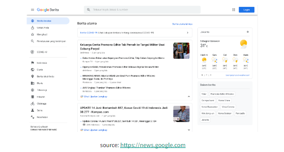
Tampilan pada Laptop/PC
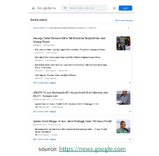
Tampilan pada Tablet
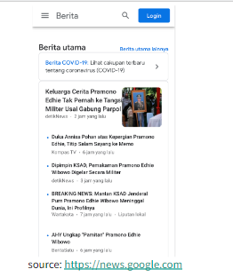
Tampilan pada Smartphone

## Setting Up Chrome Dev Tools
Untuk memudahkan proses development website, setiap developer wajib menggunakan tools bawaan dari setiap browser.

**Browser Chrome** dapat disebut sebagai Chrome Dev Tools.

Cara menggunakan Chrome Dev Tools sebagai tools RWD.
Akses Chrome Dev Tools dengan cara :
> Membuka browser kemudian menggunakan shotcut:
`Ctrl`+`Shift`+`j`
  
- Tools Responsive Web Design
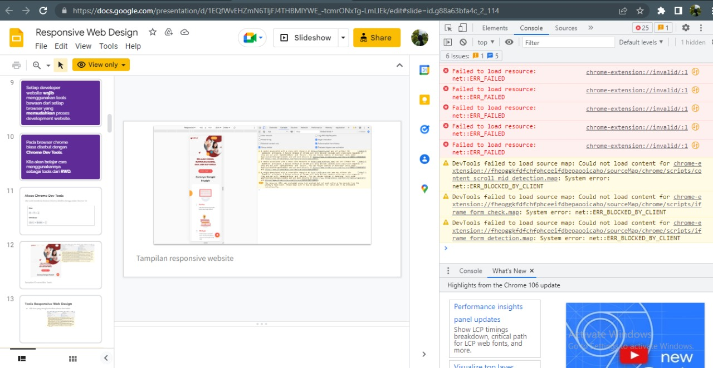
Tampilan responsive web.
Dengan cara klik pada icon yang mengilustrasikan phone/tablet.

## Add Viewport in HTML

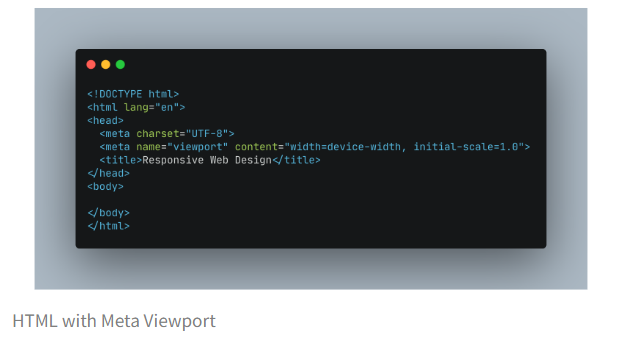

## Use Max-width Element

Untuk menyesuaikan tampilan device dengan baik.

## Media Query
Media query digunakan untuk membuat beberapa styles tergantung pada jenis device.

2 Jenis media query responsive web design :
1. min-width
2. max-width

2 cara dalam menggunakan media query :
1. Membuat file css berbeda untuk masing-masing device.
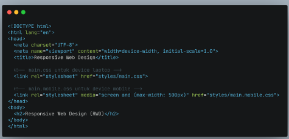
Terdapat 2 jenis file css didalamnya yaitu `main.css` untuk device laptop dan `mobile.css` untuk device mobile.

2. Menggabungkan 1 file css untuk setting styling berbagai device
- index.html
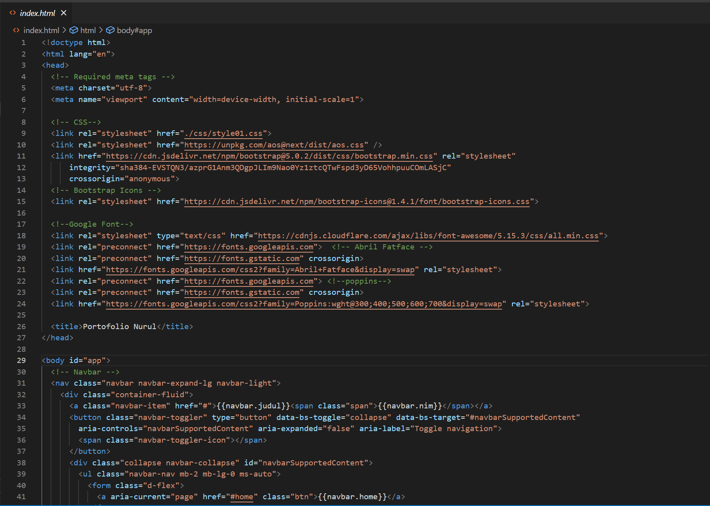
- style01.css (main.css)
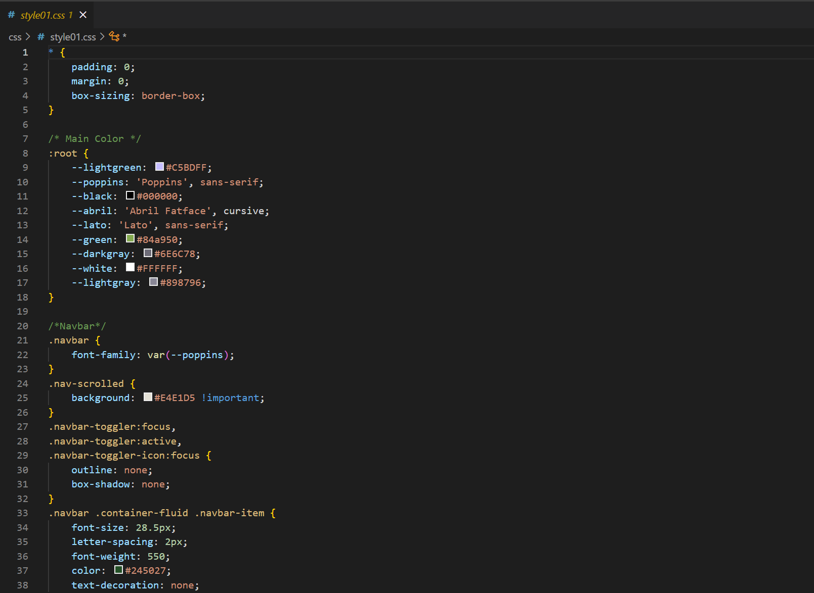

## Breakpoint
**Breakpoint** yaitu perubahan yang terjadi pada tampilan saat berganti device atau ukuran width.

Terdapat 3 breakpoint :
1. Breakpoint untuk laptop device
2. Breakpoint untuk ipad/tablet
3. Breakpoint pada mobile phone

Complex Breakpoint Media Query : Jika kita menginginkan tampilan yang ingin diterapkan pada range ukuran device tertentu, kita bisa membuatnya menjadi **range media query**

# **Bootstrap 5**

## Definisi

Sebuah framework yang paling populer digunakan untuk membuat sebuah website. Bootstrap membuat front-end developer dapat membuat website dengan cepat, fokus pada responsive mobile, dan membuat website menjadi lebih interaktif tanpa membuat banyak CSS dan JavaScript dari nol.

### Kelebihan dan Kekurangan

a) Kelebihan menggunakan Bootstrap
- Membuat website mobile-friendly
- Menghemat waktu pembuatan website
- Meminimalisir bug antar user
- Fitur kustomisasi yang berlimpah
- Meningkatkan konsistensi desain
- Bersifat open source
- Ketersediaan resource & dukungan

b) Kekurangan menggunakan Bootstrap
- Kemiripan dengan website Bootstrap lain
- Perlu proses pembelajaran
- Dapat memperlambat website

Dalam Bootstrap terdapat :

a) **Layout**
- **Breakpoints**
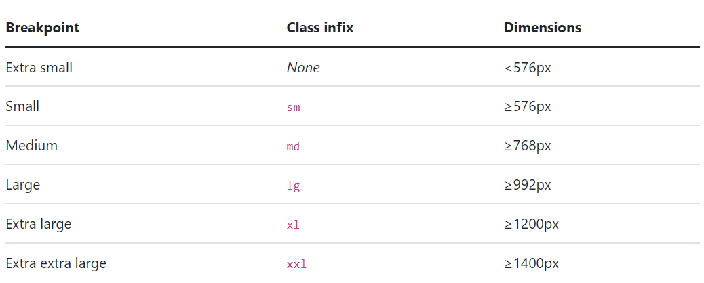
Setiap breakpoint dipilih untuk menampung container dengan lebar kelipatan 12 dengan nyaman. Breakpoint juga mewakili subset ukuran perangkat umum dan dimensi area pandang—tidak secara khusus menargetkan setiap kasus penggunaan atau perangkat. Sebaliknya, rentang memberikan fondasi yang kuat dan konsisten untuk dibangun di hampir semua perangkat.
- **Container**

    Container adalah fondasi dasar dari blok layout. Container berfungsi untuk membungkus blok di dalamnya, sehingga terlihat rapi terhadap ukuran layar. Container juga memiliki breakpoint.
    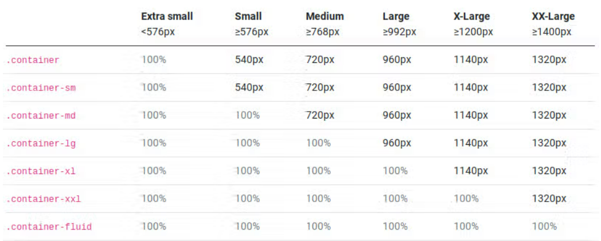
    Ukuran kontainer akan 100% pada breakpoint tertentu. Misalnya, jika kita menggunakan class `container-md` maka lebar kontainer akan 100% pada layar Extra Small dan Small.
    Terdapat 2 jenis containers :
     - **Class Container** : Class container`.container` memiliki sifat yang responsive dan fixed-width, yang berarti lebarnya akan berubah pada setiap breakpoint.
     - **Fluid Container** : Class container-fluid memiliki lebar yang sama dengan viewport.
- **Grid**

    Sistem Grid adalah sistem yang digunakan Bootstrap untuk mengatur tata letak (layout). Sistem ini terdiri dari 12 kolom dan 6 breakpoint.
    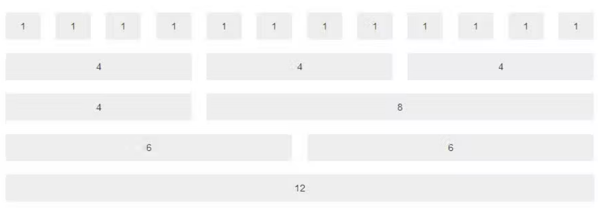
    Satu kolom penuh panjangnya adalah 12. Jika kolom dibagi dua maka panjangnya akan menjadi 6.
    
    Sistem grid Bootstrap dapat beradaptasi di keenam breakpoint default, dan setiap breakpoint yang Anda sesuaikan. Enam tingkatan grid default adalah sebagai berikut:
    - Extra small (xs)
    - Small (sm)
    - Medium (md)
    - Large (lg)
    - Extra large (xl)
    - Extra extra large (xxl)

    Berikut adalah bagaimana grid berubah di breakpoints ini:
    
- **Columns**

    Memodifikasi kolom dengan beberapa opsi untuk penyelarasan, pengurutan, dan penyeimbangan berkat sistem kisi flexbox kami. Plus, lihat cara menggunakan kelas kolom untuk mengelola lebar elemen non-kisi.
    - **Alignment** : Gunakan utilitas penyelarasan flexbox untuk menyelaraskan kolom secara vertikal dan horizontal.

            - Vertical alignment
            - Horizontal alignment
    - **Columns Break** : Memecah kolom ke baris baru di flexbox memerlukan sedikit peretasan: tambahkan elemen dengan lebar: 100% di mana pun Anda ingin membungkus kolom ke baris baru. 
    
    
    dll.

b) **Content** : Reboot, Typography, Images, Tables dan Figures

c) **Forms** : Overview, Form control, Select, Checks & radios, Range, Input group, Floating labels, Layout dan Validation

d) **Components**
- **Alerts** : 
Berikan pesan umpan balik kontekstual untuk tindakan pengguna biasa dengan beberapa pesan peringatan yang tersedia dan fleksibel.

- **Breadcumb** : sebuah komponen pada website yang berguna sebagai penanda lokasi user sekarang ini pada website anda. Dengan adanya breadcrumb membuat website lebih terasa familiar bagi user atau pengguna

- **Card** : sebuah container yang fleksible untuk content. Pada header ini kita akan membuat div dengan class card-header. Pada bagian body ini kita akan menampilkan content yang lengkap. Secara teknis kita akan membuat div dengan class card-body.

- **Modal** : Modal atau yang biasa di sebut dengan pop up pada bootstrap adalah kotak dialog yang biasa di gunakan untuk melakukan konfirmasi . Selain itu modal juga bisa di gunakan untuk melakukan insert , delete, edit data dan form login

- **Pagination** : fitur paging yang biasanya kita temui dalam sebuah tabel yang menampilkan data, dimana datanya akan dibagi menjadi beberapa halaman, nah tugas paging ini untuk membagi data tersebut kedalam beberapa halaman, bootstrap sudah menyiapkan beberapa class yang bisa anda gunakan untuk membuat fitur paging.

    dan masih banyak lainnya.

Kemudian pada minggu ini terdapat 3 kali tugas:

1. Membuat personal website menggunakan `HTML`,`CSS` dan `JS`
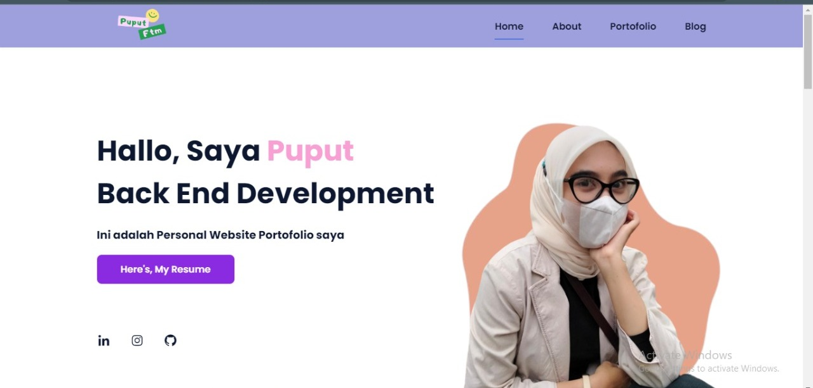
Setelah membuat website kami mengumpulkannya denga cara upload pada github dan netlify.
2. Membuat BMI Kalkulator dengan menggunakan `HTML`,`CSS` dan `JS`

Setelah membuat website kami mengumpulkannya denga cara upload pada github dan netlify.
3. Membuat Movie App dengan menggunakan TMDB API dan Fetch
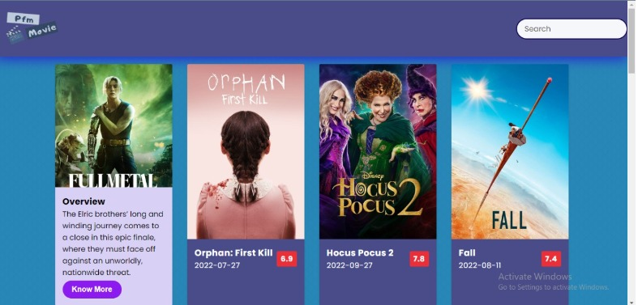
Setelah membuat website kami mengumpulkannya denga cara upload pada github dan netlify.


